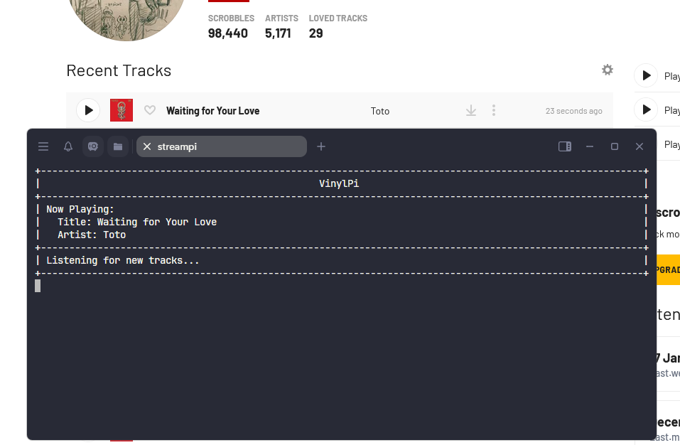

<div align="center">


## Automatically track your vinyl listening via Last.fm


<a href="">[
](https://discord.gg/9Hgvbh8UCn)</a>

</div>



### Disclaimer

This project was created partially using AI, There could be persisting errors, Please join the Discord if you'd like to help.

### Community

Please join the [Discord](https://discord.gg/9Hgvbh8UCn) if you'd like to help with development or just to hang out! 

### Ideal gear needed

Any raspberry pi, or really any ARM based SBC running a Debian based OS should work here. I've tested it using a Raspberry Pi 5 and 3 both work great.

A USB audio dongle with mic input, I've tested the [SABRENT USB External Stereo Sound Adapter](https://a.co/d/51iTuLf) with success

An RCA to 3.5mm adapter cable [this one](https://a.co/d/3N1qybu) should be fine.

Depending on your setup but a [RCA splitter](https://a.co/d/3O8gUSX) would be helpful so you can take the audio from the pre-amp and send it to your amp/speaker and the other to the pi.

### Default configuration

By default, Songs are checked 3 times for 3 seconds each, If 2 of the checks detected are the same, The song will get logged to Last.fm. You can change these variables in the "vinylpi_lib.py" file, Most of the main logic and variables are contained in this file.

  

If a "lastfm_user_info.json" is not present in the directory, You will need to fill out the Last.FM api information, The script will prompt you for this and once you enter it will be saved. This may pose a security threat as your password will be saved as a hash in the json file, Please be careful and only install this on trusted machines.

  

### Dependencies

Currently this script is designed to run on a Raspberry Pi (Tested on a Pi 3 and Pi 5). It should work on most linux distributions with these dependencies installed.

```
sudo apt-get update
sudo apt-get install python3 python3-pip portaudio19-dev ffmpeg libasound2-dev git

```

### Install instructions

First, go to [Last.FM API Create](https://www.last.fm/api/account/create) And fill out the form (You do not have to have a Callback URL or Application Homepage, You can leave that empty) Once created save the information to a safe place it will be needed for the script.

```
git clone https://github.com/powerpcme/VinylPi.git

cd VinylPi

pip install -r requirements.txt --break-system-packages

python VinylPi.py
```

Run the script once to configure it, It should run you though applying the API credentials as well as your Lastfm login. 

### Running options 

-h  - Help command 
-v or --verbose - This is useful for debugging, In case no songs are being detected.
-l or --list-devices - List current audio input devices
-d or --device - Use the number given to the device from the list command here, If this is not specified, It will use the first USB audio device it finds for input. 
-t or --tui - If you do not plan on using this headless, This will provide a nice terminal UI displaying the currently playing song

### Post install

To run as a service first create a service file
```
sudo nano /etc/systemd/system/vinylpi.service
```

Then paste this as an example, Replace the user and script location with your script location

```
[Unit]
Description=VinylPi
After=network.target

[Service]
ExecStart=/usr/bin/python3 /home/vinylpi/vinylpi.py -v
WorkingDirectory=/home/vinylpi/
StandardOutput=inherit
StandardError=inherit
Restart=always
TimeoutStartSec=300
TimeoutStopSec=300
StartLimitBurst=3
StartLimitIntervalSec=300
User=vinylpi

[Install]
WantedBy=multi-user.target

```

Then enable the service to run on boot and start it.

```
sudo systemctl enable vinylpi.service

sudo systemctl start vinylpi.service
```


### Command examples

```
python VinylPi.py -v - Verbose output
python VinylPi.py -l - List avalible devices for use
python VinylPi.py -d 1 - Using the number assigned to the device from the list command, this will set the script to use that device
python VinylPi.py -t - Use the TUI interface to see what tracks are being played
```

### Current bugs 

- Right now when the script is ran, A lot of ALSA garbage is displayed but cleared after a bit, Unsure how to fix this but not really program breaking.
- Since we are using Shazam for the song detection, It seems more obscure songs are not getting picked up, We could potentially add other detection methods in the future but this is the easiest currently. 

### Future additions

- I would like to have a docker version of this that would make installation a bit more straight forward.
- Some sort of discord rich presence add on would be cool, Unsure of how to add this with out it being a hassle. 
